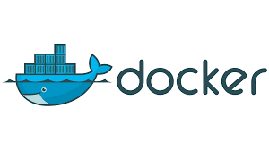
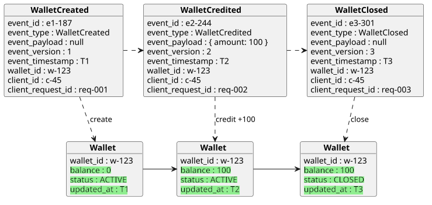
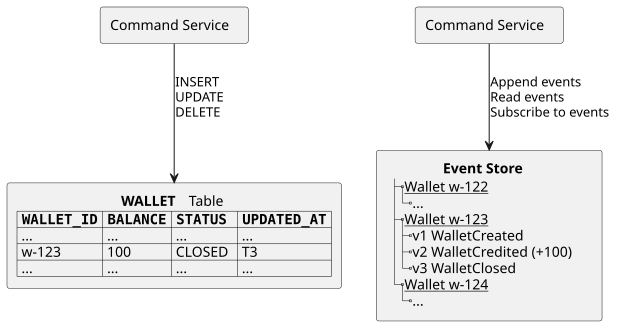
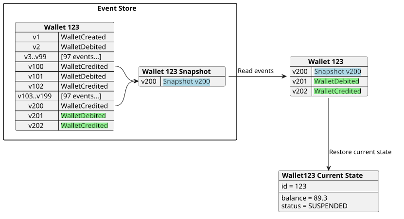
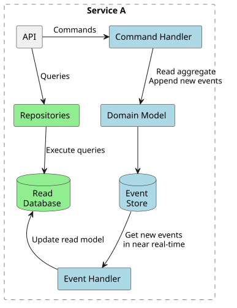
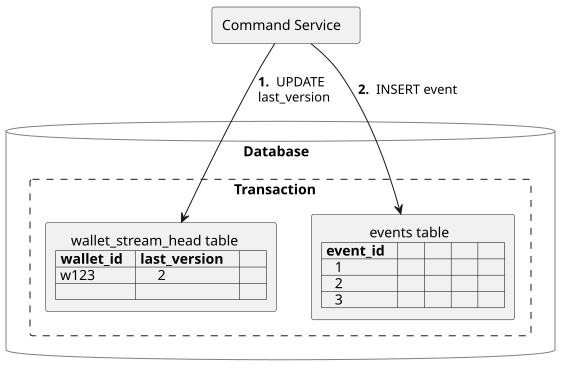
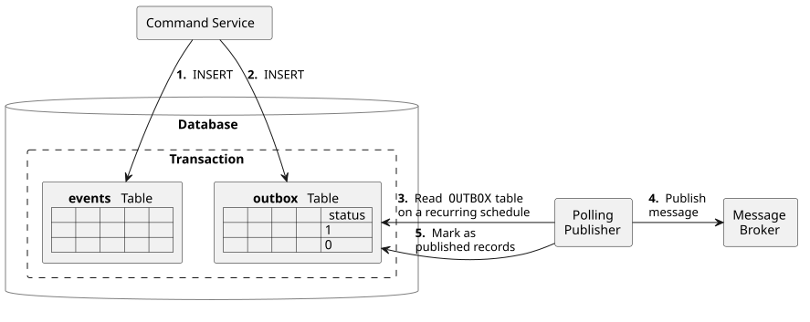
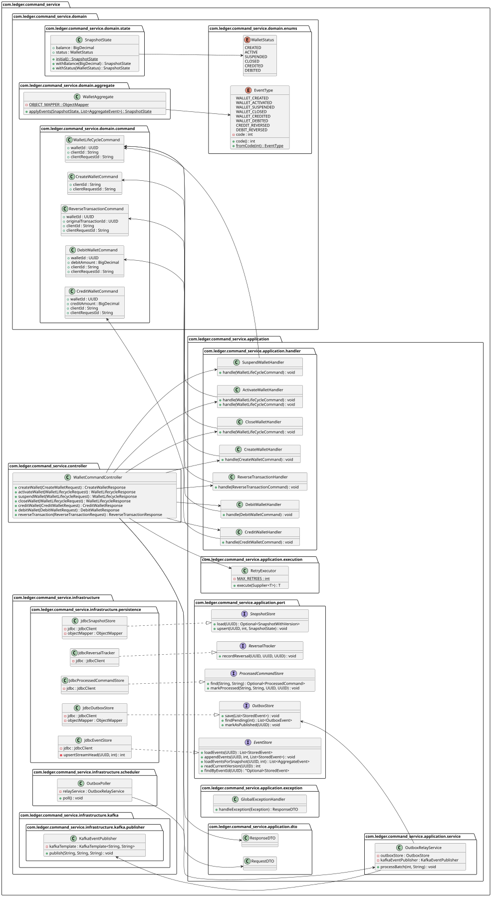
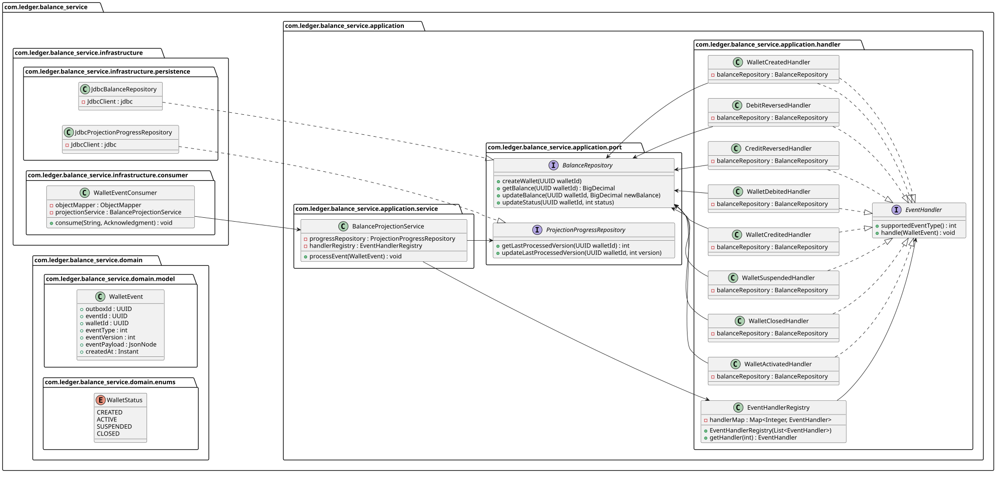

# <a id="0"></a>Event Sourcing with PostgreSQL

- [Event Sourcing with PostgreSQL](#1)
  - [Introduction](#1)
  - [Technologies Used](#technologies-used)
  - [Example domain](#2)
  - [Event sourcing and CQRS basics](#3)
    - [State-oriented persistence](#3-1)
    - [Event sourcing](#3-2)
    - [Snapshotting](#3-3)
    - [Querying the data](#3-4)
    - [CQRS](#3-5)
    - [Event handlers](#3-6)
    - [Advantages of CQRS](#3-8)
    - [Advantages of event sourcing](#3-9)
  - [Solution architecture](#4)
    - [Component diagram](#4-1)
    - [ER diagram](#4-2)
    - [Optimistic concurrency control](#4-3)
    - [Snapshotting](#4-4)
    - [Loading any revision of the aggregate](#4-5)
    - [Synchronously updating projections](#4-6)
    - [Asynchronously sending integration events to a message broker](#4-7)
      - [Database polling](#4-7-3)
      - [Listen/Notify as an alternative to database polling](#4-8)
    - [Drawbacks](#4-9)
  - [Project structure](#5)
    - [Folder structure](#5-1) 
    - [Database schema migrations](#5-2)
    - [Class diagrams](#5-3)
      - [Class diagram of the command side](#5-3-1)
      - [Class diagram of the balance projection side](#5-3-2)
  - [How to run the sample?](#7)

<!-- Table of contents is made with https://github.com/eugene-khyst/md-toc-cli -->

## <a id="1"></a>Introduction

Usually, our applications operate with the current state of a domain object.
But sometimes, we need to know the entire history of the domain object changes.
For example, we want to know how wallet got into its current state.

The audit trail (also called the audit log) is a chronological record of the history and details of the actions that affected the system.
An audit trail may be a regulatory or business requirement.

We can persist every change to a domain object as a sequence of immutable events in an append-only log, ensuring that the full history of state transitions is preserved. This raises the question of reliability—how do we guarantee that this history remains consistent and trustworthy?

In this approach, event streams become the system’s single source of truth. The current state of any object is derived by replaying its events in the exact order they occurred. This architectural pattern is known as event sourcing, and the storage mechanism used is called an event store.

By design, event sourcing maintains a complete, traceable, and tamper-resistant record of all changes, making it a widely adopted standard for building robust audit trails.

There are specialized databases for event sourcing.
Developer Advocates working for the companies behind these specialized databases said
you shouldn't implement event sourcing with traditional relational or document-oriented databases.
Is this true or just a marketing ploy?

There are databases specifically built for event sourcing, and developer advocates behind these products often claim that traditional relational or document databases aren’t suitable for implementing it. But is that really the case, or just marketing?

While specialized event-sourcing databases do offer convenience and built-in features tailored for this pattern, they aren’t strictly necessary. **PostgreSQL**, one of the most advanced open-source databases, is fully capable of supporting event sourcing. It can function effectively as an event store without requiring extra frameworks or extensions, allowing you to avoid the overhead of introducing and maintaining a separate specialized system.


## <a id="technologies-used"></a>Technologies Used





## <a id="2"></a>Example domain

This sample uses a simplified domain model of the ride-hailing system.

* Client System is the only actor — no human users, purely system-to-system.
* Account Lifecycle — Create → Activate → Suspend → Close.
* Money Movement — Credit and Debit are the core transaction operations.
* Reversal — Any transaction can be reversed, maintaining ledger integrity.
* All actions are commands — every operation mutates ledger state and is event-sourced.


## <a id="3"></a>Event sourcing and CQRS basics

### <a id="3-1"></a>State-oriented persistence

State-oriented persistence (CRUD) applications store only the latest version of an entity.
Database records present entities.
When an entity is updated, the corresponding database record gets updated too.
SQL `INSERT`, `UPDATE` and `DELETE` statements are used.


### <a id="3-2"></a>Event sourcing

Event sourcing applications persist the state of an entity as a sequence of immutable state-changing events.




Whenever the state of an entity changes, a new event is appended to the list of events.
Only SQL `INSERT` statements are used.
Events are immutables, so SQL `UPDATE` and `DELETE` statements are not used.




The current state of an entity can be restored by replaying all its events.

Event sourcing is closely related to domain-driven design (DDD) and shares some terminology.

An entity in event sourcing is called an **aggregate**.

A sequence of events for the same aggregate is called a **stream**.

Event sourcing is best suited for short-living entities with a small total number of
events (e.g., orders).

Restoring the state of the short-living entity by replaying all its events doesn't have any
performance impact. Thus, no optimizations for restoring state are required for short-living
entities.

For endlessly stored entities (e.g., users, bank accounts) with thousands of events restoring state
by replaying all events is not optimal, and snapshotting should be considered.

### <a id="3-3"></a>Snapshotting

Snapshotting is an optimization technique where a snapshot of the aggregate's state is also saved,
so an application can restore the current state of the aggregate from the snapshot rather than from
all the events (potentially thousands).

On every *nth* event, make an aggregate snapshot by storing an aggregate state and its version.

To restore an aggregate state:

1. first read the latest snapshot,
2. then read events forward from the original stream starting from the version pointed by the snapshot.




### <a id="3-4"></a>Querying the data

While it's straightforward to retrieve a wallet by its ID, querying wallets by other criteria becomes challenging in an event-sourced system. Wallets are stored as append-only sequences of immutable events rather than mutable records, making traditional SQL queries difficult or impossible. To query wallets by attributes like owner ID or status, the system would need to read all events from the event stream and replay them to reconstruct wallet state for every query—an inefficient and impractical approach.

To restore the querying power of a relational database without sacrificing the benefits of event sourcing, the system maintains a **dedicated read model** derived from the event stream. The event stream serves as the **write model** and the single source of truth for all wallet state changes. The read model is a denormalized, optimized view of the event stream data, enabling fast and convenient queries without the overhead of event replay.

Read models are projections of system state. They are asynchronously updated by consuming events from the event stream and transforming them into queryable formats. For the wallet domain, projections provide:
- **Single aggregate projections** - Views of individual wallet state for quick retrieval by ID
- **Cross-aggregate projections** - Aggregations combining data from multiple wallets (e.g., total credits across all wallets, wallets in suspended state)

This separation of concerns—write model for correctness and immutability, read model for query flexibility—is the foundation of **CQRS (Command Query Responsibility Segregation)**. CQRS allows the system to scale reads independently from writes, optimize each for its specific purpose, and maintain strong consistency on writes while accepting eventual consistency on reads.

### <a id="3-5"></a>CQRS

CQRS (Command Query Responsibility Segregation) is an architectural pattern that separates write operations (commands) from read operations (queries) by having them processed through different handlers and potentially stored in different data models.

Commands represent requests to change the state of the system (e.g., create a wallet, credit funds), while queries are used to retrieve current state information without modifying it (e.g., check wallet balance). By keeping these concerns separate, the system can optimize each path independently.

While CQRS can be used standalone, it pairs naturally with event sourcing. In this architecture, the event store serves as the authoritative write model, while separate read databases (projections) provide optimized query access to wallet data—enabling both strong consistency on writes and fast, flexible reads.



### <a id="3-6"></a>Event handlers

Commands generate events.
Event processing is done by **event handlers**.
As a part of event processing, we may need to update projections,
send a message to a message broker, or make an API call.

for more detail of event handling refer to [Event Modelling](software-docs/event%20%20modelling/Event%20Modelling.pdf).

There are two types of event handlers: **synchronous** and **asynchronous**.

#### Synchronous Event Handlers

Storing the write model and read model in the same database allows for transactional updates of the read model.
Each time we append a new event, the projection is updated **synchronously** in the same transaction.
The projection is **consistent** with the event stream.

This ensures **strong consistency** on the write side: once a command succeeds and a transaction commits, the event and all its projections are durably persisted and immediately queryable.

#### Asynchronous Event Handlers

When an event handler communicates with an external system or middleware (e.g., sends a message to Kafka),
it should run **asynchronously** after the transaction updating the write model.
Asynchronous execution leads to **eventual consistency**.

Communication with external systems should not occur in the same transaction updating the write model.
The external system call may succeed, but the transaction will later be rolled back, resulting in an inconsistency.

#### CAP Theorem and System Design

This system follows the **CP (Consistency over Availability)** model as explained in the [Consistency Model](software-docs/architecture%20and%20hld/consistency%20model/Consistency%20Model.pdf):
- **Consistency (C)** - The write model is always consistent; events are either fully persisted or not at all
- **Partition Tolerance (P)** - The system assumes network partitions can occur
- **Availability (A)** - Sacrificed during network failures or storage issues; the system becomes unavailable rather than serving stale or inconsistent data

In practice, if events cannot be persisted due to network or storage failures, the system becomes unavailable and rejects the command with an appropriate error. This ensures that financial data remains correct and auditable, a critical requirement for wallet systems.

Distributed systems should still be designed with **eventual consistency** in mind for read-side projections. While writes are strongly consistent, reads from projections may temporarily lag behind the latest events until projections are updated asynchronously.


### <a id="3-8"></a>Advantages of CQRS

* Independent scaling of the read and write databases.
* Optimized data schema for the read database (e.g. the read databases can be denormalized).
* Simpler queries (e.g. complex `JOIN` operations can be avoided).

### <a id="3-9"></a>Advantages of event sourcing

* A true history of the system (audit and traceability).
  An industry standard for implementing audit trail.
* Ability to put the system in any prior state (e.g. for debugging).
* New read-side projections can be created as needed (later) from events.
  It allows responding to future needs and new requirements.

## <a id="4"></a>Solution architecture

PostgreSQL can be used as an event store.
It will natively support appending events, concurrency control and reading events.
Subscribing on events requires additional implementation.

### <a id="4-1"></a>Component diagram


### <a id="4-2"></a>ER diagram


Events are stored in the `events` table.

### <a id="4-3"></a>Optimistic concurrency control

Latest aggregate version is stored in the `wallet_stream_head` table.
Version checking is used for optimistic concurrency control.
Version checking uses version numbers to detect conflicting updates (and to prevent lost updates).

Appending an event operation consists of 2 SQL statements in a single transaction:

1. increment the version
    ```sql
    INSERT INTO wallet_stream_head (wallet_id, last_version, updated_at)
    VALUES (?, ?, ?)
    ON CONFLICT (wallet_id)
    DO UPDATE SET
        last_version = EXCLUDED.last_version,
        updated_at = EXCLUDED.updated_at
    ```
    **Parameters:** 
    - `?` (1st param) - `walletId`
    - `?` (2nd param) - `newVersion`
    - `?` (3rd param) - `Timestamp.from(Instant.now())`

2. insert event record
    ```sql
    INSERT INTO events (
        event_id,
        wallet_id,
        event_type,
        event_payload,
        event_version,
        event_timestamp,
        client_id,
        client_request_id
    ) VALUES (?, ?, ?, ?::jsonb, ?, ?, ?, ?)
    ```
    **Parameters:** 
    - `?` (1st param) - `event.eventId()`
    - `?` (2nd param) - `walletId`
    - `?` (3rd param) - `event.eventType()`
    - `?` (4th param) - `event.eventPayload()` (cast to JSONB)
    - `?` (5th param) - `nextVersion`
    - `?` (6th param) - `Timestamp.from(event.eventTimestamp())`
    - `?` (7th param) - `event.clientId()`
    - `?` (8th param) - `event.clientRequestId()`


### <a id="4-3-1"></a> How optimistic concurrency control works

Optimistic concurrency control prevents lost updates by detecting version conflicts before persisting events. The mechanism works at two levels: **application code** and **database constraints**.

#### Application-Level Version Check

Before appending an event, the application reads the current version of the aggregate and compares it with the expected version:

```java
int currentVersion = readCurrentVersion(walletId);
if (currentVersion != expectedVersion) {
    throw new OptimisticLockException(
        "version mismatch"
    );
}
```

If the versions don't match, it indicates that another process has already modified the aggregate since this command was received. The command is rejected to prevent overwriting those changes.

#### Database-Level Unique Constraint

Even if concurrent requests bypass the application check, the database enforces a unique constraint on the `(wallet_id, event_version)` combination:

```sql
CREATE UNIQUE INDEX idx_events_wallet_version
ON events (wallet_id, event_version);
```

This ensures that no two events for the same wallet can have the same version number. If a concurrent request tries to insert an event with a version that already exists, the database will reject it with a `DuplicateKeyException`.

#### Exception Handling

When a duplicate key violation occurs at the database level, it is caught and translated into an `OptimisticLockException`:

```java
try {
    // Insert event with expected version
    jdbc.sql("""
        INSERT INTO events (wallet_id, event_version, ...)
        VALUES (?, ?, ...)
        """)
        .params(walletId, nextVersion, ...)
        .update();
} catch (DuplicateKeyException e) {
    throw new OptimisticLockException("version mismatch");
}
```

#### How It Prevents Lost Updates

1. **Transaction A** reads wallet version as `5`
2. **Transaction B** reads wallet version as `5`
3. **Transaction B** appends an event with version `6` → succeeds
4. **Transaction A** attempts to append an event with version `6` → fails with `DuplicateKeyException` → translated to `OptimisticLockException`
5. **Transaction A** must retry, re-read the current version (`6`), and attempt with version `7`

This two-level approach (application + database) ensures data consistency and prevents concurrent modification conflicts.

#### Retry Logic and Resilience

When an `OptimisticLockException` occurs due to a version conflict, the system does not immediately fail the request. Instead, the command handler is wrapped in a **retry executor** that automatically retries the operation:

```java
retryExecutor.execute(() -> creditWalletHandler.handle(command));
```

The [`RetryExecutor`](services/command-service/src/main/java/com/ledger/command_service/application/execution/RetryExecutor.java) component is responsible for implementing resilience by retrying failed commands with a maximum of **3 attempts**. When a retry occurs, the handler re-reads the current aggregate version and recomputes the command with the new version, ensuring consistency.

#### Retry Strategies

The system supports multiple retry strategies that can be configured based on resilience requirements:

**1. No Delay Strategy (1..N)**
- Retries immediately without any delay between attempts
- Useful for low-contention scenarios where conflicts are rare
- Fastest recovery but may increase CPU usage under high contention

**2. Fixed Delay Strategy**
- Applies a constant delay (e.g., 200ms) between each retry attempt
- Simple and predictable, suitable for scenarios with moderate contention
- Example: `Thread.sleep(200L)` between retries

**3. Exponential Backoff with Jitter Strategy**
- Increases the delay exponentially with each retry attempt: `2^attempt * 100ms`
- Adds random jitter to prevent thundering herd problem
- Example: 1st retry delay = 100-200ms, 2nd retry delay = 200-400ms, 3rd retry delay = 400-800ms
- Best for high-contention scenarios and distributed systems

If all **3 retry attempts** are exhausted, a `RetryLaterException` is thrown, signaling to the client that the operation should be retried at a later time.



### <a id="4-4"></a>Snapshotting

Snapshotting is an optimization technique that periodically captures the complete state of an aggregate at a specific version. This eliminates the need to replay all events from the beginning when reconstructing the aggregate state, significantly improving performance for aggregates with large event histories.

In this system, **only the latest snapshot is maintained** per wallet. When a new snapshot is created, it replaces the previous one using an upsert operation.

#### Inserting/Updating a Snapshot

```sql
INSERT INTO snapshot (
    wallet_id,
    snapshot_version,
    snapshot_state,
    snapshot_timestamp
)
VALUES (?, ?, ?::jsonb, now())
ON CONFLICT (wallet_id)
DO UPDATE SET
    snapshot_version   = EXCLUDED.snapshot_version,
    snapshot_state     = EXCLUDED.snapshot_state,
    snapshot_timestamp = now()
```

**Parameters:**
- `?` (1st param) - `walletId`
- `?` (2nd param) - `version` (the version at which this snapshot was taken)
- `?` (3rd param) - `jsonState` (the complete wallet state as JSON, cast to JSONB)

The `ON CONFLICT` clause ensures that if a snapshot already exists for the wallet, it is updated with the new version and state, effectively replacing the previous snapshot.

#### Retrieving the Latest Snapshot

To load the aggregate state, the system retrieves the latest snapshot for the wallet:

```sql
SELECT wallet_id,
       snapshot_version,
       snapshot_state
FROM snapshot
WHERE wallet_id = ?
```

**Parameters:**
- `?` (1st param) - `walletId`

Since only the latest snapshot exists per wallet, this query returns a single row containing the complete wallet state at the snapshot version. This allows the system to reconstruct the aggregate state efficiently without replaying all events from the beginning. Any events recorded after the snapshot version are replayed incrementally to bring the aggregate to its current state.


### <a id="4-5"></a>Loading any revision of the aggregate

After retrieving the snapshot, the system replays all events recorded after the snapshot version to bring the aggregate to its current state:

```sql
SELECT event_type,
       event_payload
FROM events
WHERE wallet_id = ?
  AND event_version > ?
ORDER BY event_version ASC
```

**Parameters:**
- `?` (1st param) - `walletId`
- `?` (2nd param) - `version` (the snapshot version)

This query retrieves all events that occurred after the snapshot version in ascending order. By replaying these events sequentially, the system reconstructs the complete and current state of the wallet without needing to replay the entire event history from the beginning. This approach significantly improves performance for aggregates with large event histories.

### <a id="4-6"></a>Synchronously updating projections

Using PostgreSQL as an event store and a read database allows for transactional updates of the read model.
Each time we append a new event, the projection is updated synchronously in the same transaction.
It's a big advantage because sometimes consistency is not so easy to achieve.

You can't get consistent projections when a separate database is used as an event store.

### <a id="4-7"></a>Asynchronously sending integration events to a message broker

Integration events should be sent asynchronously after the transaction updating the write model.

PostgreSQL doesn't allow subscribing on changes, so the solution is a `Transactional Outbox pattern`.
A service that uses a database inserts events into an outbox table as part of the local transaction.
A separate process publishes the events inserted into database to a message broker.



#### Implementation

In this system, the transactional outbox pattern is implemented in a simplified manner. When an event is appended to the event store, an outbox entry is inserted into the same transaction with an initial status of `0` (unpublished). This ensures atomicity—either both the event and outbox entry are persisted together, or neither is persisted at all. A background process then polls the outbox table, publishes events with status `0` to the message broker, and updates their status to `1` (published), ensuring no event is lost or published multiple times.
#### <a id="4-7-3"></a>Database Polling

To get new events from the `outbox` table, the application has to poll the database at regular intervals. The polling mechanism is implemented using Spring's `@Scheduled` annotation in the [`OutboxPoller`](services/command-service/src/main/java/com/ledger/command_service/infrastructure/scheduler/OutboxPoller.java) component.

The `poll()` method runs at a fixed interval (e.g., every 5 seconds) and processes a batch of unpublished events (status = 0) from the outbox table.

**Trade-off:** The shorter the polling period, the shorter the delay between persisting an event and processing it. However, there is an inherent lag—if the polling period is 5 seconds, the maximum delay is 5 seconds. More frequent polling reduces latency but increases database load.

##### Known Issues and Improvements

**Issue 1: Duplicate Publishing in Distributed Environments**

In a distributed system with multiple service instances, each poller can pick up the same unpublished events from the outbox table, causing duplicate publishing to the message broker.

**Potential Improvement:** Use `FOR UPDATE SKIP LOCKED` to ensure row-level locking:

```sql
SELECT ...
FROM outbox
WHERE status = 0
ORDER BY created_at ASC
LIMIT 100
FOR UPDATE SKIP LOCKED
```

This prevents concurrent pollers from selecting the same rows. However, this approach alone may not be sufficient in highly distributed environments.

**Better Solution:** Implement a subscription table with transaction-level locks to coordinate which poller instance should process which batch of events, ensuring only one instance claims ownership of events at a time.

---

**Issue 2: Polling is Expensive**

Polling the database at regular intervals creates unnecessary database load, especially when there are no new events to publish. This results in:
- Increased database queries and CPU usage
- Network overhead
- Scalability limitations as the number of pollers increases

**Potential Improvement:** Use PostgreSQL's `LISTEN/NOTIFY` mechanism to implement event-driven polling:

```sql
LISTEN outbox_events;
```

Instead of periodically polling, the outbox insertion can trigger a `NOTIFY` that wakes up listening subscribers immediately. This eliminates polling overhead and provides near-real-time event propagation without sacrificing performance.

---

**Trade-offs:** While the current simple transactional outbox pattern with polling is easy to implement and understand, addressing these two issues requires more complex distributed coordination and event notification mechanisms. The improvements enhance scalability and reduce latency but introduce additional operational complexity.

### <a id="4-8"></a>Listen/Notify as an alternative to database polling

PostgreSQL's `LISTEN/NOTIFY` mechanism provides an event-driven alternative to continuous database polling. Instead of repeatedly querying the outbox table at fixed intervals, the system can subscribe to change notifications:

```sql
LISTEN outbox_events;
```

When new events are inserted into the outbox table, a trigger or application code can issue:

```sql
NOTIFY outbox_events;
```

This immediately awakens all listening subscribers, allowing them to fetch and process events in real-time. Key benefits include:

- **Near-zero latency** - Events are processed immediately after insertion, not after the next polling cycle
- **Reduced database load** - No unnecessary queries when there are no events to publish
- **Better scalability** - The system can handle more subscribers without exponential increase in database queries
- **Event-driven architecture** - Aligns with reactive programming principles

However, `LISTEN/NOTIFY` has limitations:
- Notifications are **in-memory only** and are lost if the connection is closed
- Not suitable for long-running processes or service restarts
- Requires connection pooling and subscription management

A hybrid approach could combine both mechanisms: use `LISTEN/NOTIFY` for real-time processing of new events, while periodically polling for any events that may have been missed due to connection issues or service restarts.

### <a id="4-9"></a>Drawbacks

Using PostgreSQL as an event store provides many benefits, but has some limitations:

1. **Duplicate Event Processing**
   Asynchronous event handlers may crash after processing an event but before persisting the completion status. On restart, they reprocess the same event, leading to duplicate integrations (e.g., duplicate Kafka messages). This requires event consumers to be idempotent and handle duplicates gracefully.

2. **Eventual Consistency Lag**
   Integration events are published asynchronously with a polling delay (default 1 second). This introduces consistency lag between the write model and external systems, meaning reads from downstream services may temporarily see stale data.

3. **Long-Running Transactions Block Event Handlers**
   A single long-running transaction can effectively pause all event handlers. The outbox poller waits for such transactions to commit before processing newer events, creating bottlenecks in high-throughput scenarios.

4. **At-Least-Once Delivery Guarantee**
   The transactional outbox pattern guarantees events are delivered at least once, not exactly once. Achieving exactly-once delivery requires complex distributed coordination mechanisms that are difficult to implement without two-phase commit (2PC).


## <a id="5"></a>Project structure

###  <a id="5-1"></a>Project modules or Folder structure:

```
├── db/
│   ├── event_db/              Event store schema and indexes
│   ├── balance_db/            Balance projection database schema
│   ├── history_db/            Transaction history database schema
│   └── db_scripts/            Database migration and execution scripts
│
├── services/
│   ├── command-service/     Command handler and write model
│   ├── query-service/       Query handler and read model
│   ├── balance-service/     Balance projection service
│   ├── history-service/     History projection service
│   └── ledger-api-gateway/  API gateway request routing
│
├── software-docs/             Architecture and technical documentation
├── docker-commands/           Docker operations reference
├── img/                       Architecture diagrams and logos
├── plantuml/                  PlantUML diagram source files
├── testing/                   Test scripts and utilities
└── docker-compose.yml         Container orchestration configuration
```

### <a id="5-2"></a>Database schema migrations

Event sourcing related database schema:
* [schema_event.sql](db/event_db/schema_event.sql)
* [index_event.sql](db/event_db/index_event.sql)

Projection related database schema:
* [schema_balance.sql](db/balance_db/schema_balance.sql)
* [index_balance.sql](db/balance_db/index_balance.sql)
* [schema_history.sql](db/history_db/schema_history.sql)
* [index_history.sql](db/history_db/index_history.sql)

### <a id="5-3"></a>Class diagrams

#### <a id="5-3-1"></a>Class diagram of the command side



#### <a id="5-3-2"></a>Class diagram of the balance projection side (history side almost same)




## <a id="7"></a>How to run the sample?

### Quick Start

#### 1. Install Docker

Download and install [Docker Desktop](https://www.docker.com/products/docker-desktop) for your operating system (Windows, macOS, or Linux).

#### 2. Run Docker Compose

From the project root directory, execute:

```bash
docker compose build
docker compose up -d
```

This will start all services and databases. The API Gateway will be available at `http://localhost:8081`.

### Sample API Requests

Once the system is running, you can interact with the wallet API.

#### Create a Wallet

**URL:** `http://localhost:8081/api/commands/wallet/create`  
**Method:** POST

#### Query Current Wallet Info

**URL:** `http://localhost:8081/api/queries/currentInfo/{walletId}`  
**Method:** GET  

Example: `http://localhost:8081/api/queries/currentInfo/43b1a575-a7bb-4901-9c5c-25a77a64bd58`

#### Credit a Wallet

**URL:** `http://localhost:8081/api/commands/wallet/credit`  
**Method:** POST

#### Debit a Wallet

**URL:** `http://localhost:8081/api/commands/wallet/debit`  
**Method:** POST

### API Documentation

For detailed API documentation including request/response formats and all available endpoints, refer to [`software-docs/api`](software-docs/api/README.md).

---

## References

This project is inspired by and based on the [Event Sourcing example of Ride-hailing system](https://github.com/eugene-khyst/postgresql-event-sourcing/tree/main). Thanks to the creators and contributors of that repo learnt lot fromt there and implemented.


